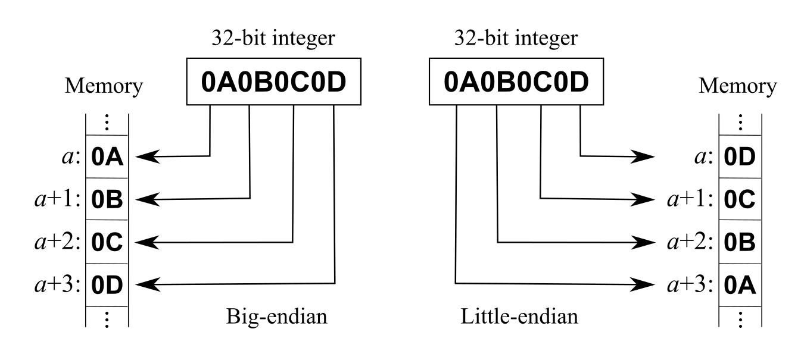

## About the ESP32 Air Quality Monitor

* The [Air Quality Monitor](https://emeric.io/EnvironmentalSensors/#airqualitymonitor) is meant to keep you alive by monitoring your environment
* It has sensors to relay temperature, humidity, local air pressure, PM levels, CO2 levels, VOC levels and much more...
* Uses Bluetooth Low Energy (BLE) and has a limited range

## Features

* Read real-time sensor values
* Temperature, humidity and pressure
* PM levels (particulate matter) (PM 2.5 & 10 µm)
* TVOC and eCO2 levels
* Features can be extended through available GPIO and an open firmware

## Protocol

The device uses BLE GATT for communication.  
Sensor values are immediately available for reading, through standard read/notify characteristics.  

### BLE & GATT

The basic technologies behind the sensors communication are [Bluetooth Low Energy (BLE)](https://en.wikipedia.org/wiki/Bluetooth_Low_Energy) and [GATT](https://www.bluetooth.com/specifications/gatt).
They allow the devices and the app to share data in a defined manner and define the way you can discover the devices and their services.
In general you have to know about services and characteristics to talk to a BLE device.

### Data structure

The data is encoded in little-endian byte order.  
This means that the data is represented with the least significant byte first.

To understand multi-byte integer representation, you can read the [endianness](https://en.wikipedia.org/wiki/Endianness) Wikipedia page.

## Services, characteristics and handles

The name advertised by the device is `AirQualityMonitor`

##### Generic Access (UUID 00001800-0000-1000-8000-00805f9b34fb)

| Characteristic UUID                  | Handle | Access      | Description |
| ------------------------------------ | ------ | ----------- | ----------- |
| 00002a00-0000-1000-8000-00805f9b34fb | -      | read        | device name |

##### Device Information (UUID 0000180a-0000-1000-8000-00805f9b34fb)

| Characteristic UUID                  | Handle | Access      | Description                 |
| ------------------------------------ | ------ | ----------- | --------------------------- |
| 00002a24-0000-1000-8000-00805f9b34fb | -      | read        | model number string         |
| 00002a26-0000-1000-8000-00805f9b34fb | -      | read        | firmware revision string    |

##### Battery service (UUID 0000180f-0000-1000-8000-00805f9b34fb)

| Characteristic UUID                  | Handle | Access      | Description                 |
| ------------------------------------ | ------ | ----------- | --------------------------- |
| 00002a19-0000-1000-8000-00805f9b34fb | -      | read        | battery level               |

##### Data service (UUID eeee9a32-a000-4cbd-b00b-6b519bf2780f)

| Characteristic UUID                  | Handle | Access      | Description                         |
| ------------------------------------ | ------ | ----------- | ----------------------------------- |
| eeee9a32-a0a0-4cbd-b00b-6b519bf2780f | -      | read/notify | get Air Monitor realtime data       |
| eeee9a32-a0b0-4cbd-b00b-6b519bf2780f | -      | read/notify | get Weather Station realtime data   |
| eeee9a32-a0c0-4cbd-b00b-6b519bf2780f | -      | read/notify | get HiGrow realtime data            |
| eeee9a32-a0d0-4cbd-b00b-6b519bf2780f | -      | read/notify | get Geiger Counter realtime data    |

### Real-time data

A read request will return 16 bytes of data, for example `0x00`.  
You can subscribe to this handle and and receive notifications for new values (once per second) by writing 2 bytes (`0x0100`) to the Client Characteristic Configuration descriptor (`0x2902`).  

| Position | 00 | 01 | 02 | 03 | 04 | 05 | 06 | 07 | 08 | 09 | 10 | 11 | 12 | 13 | 14 | 15 |
| -------- | -- | -- | -- | -- | -- | -- | -- | -- | -- | -- | -- | -- | -- | -- | -- | -- |
| Value    | 40 | 01 | 25 | D4 | 03 | 90 | 01 | 8A | 02 | 00 | 00 | 00 | 00 | 00 | 00 | 00 |

| Bytes | Type       | Value | Description                  |
| ----- | ---------- | ----- | ---------------------------- |
| 00-01 | uint16     | 320   | temperature in 0.1 °C        |
| 02    | uint8      | 37    | humidity in %RH              |
| 03-04 | uint16     | 980   | local air pressure in hPa    |
| 05-06 | uint16     | 400   | tVOC                         |
| 07-08 | uint16     | 650   | eCO2                         |

#### Historical data

None yet

### Advertisement data

None yet

## Reference

[1] https://emeric.io/EnvironmentalSensors/#airqualitymonitor  
[2] https://github.com/emericg/esp32-environmental-sensors/tree/master/AirQualityMonitor  

## License

MIT
